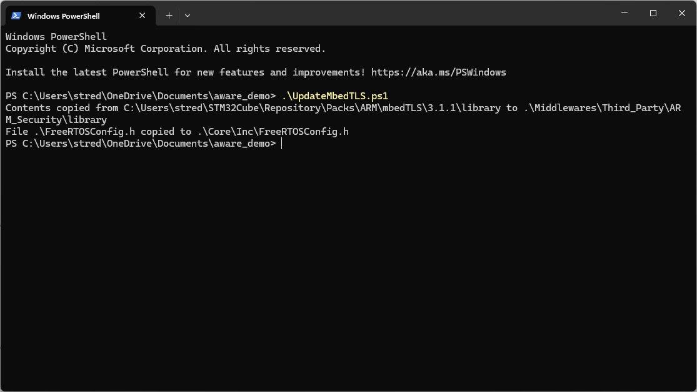

# aware_demo

## CMSIS Packs

If you need to regenerate the project with STM32CubeMX, then you need to dowload and install the following CMSIS packs.

[lwIP 2.2.0](https://www.keil.com/pack/lwIP.lwIP.2.2.0.pack)

[mbedTLS 3.1.1](https://www.keil.com/pack/ARM.mbedTLS.3.1.1.pack)

## UpdateMbedTLS.ps1 Script
* If you regenerate the project with STM32CubeMX, then you need to run *UpdateMbedTLS.ps1* script before building the project with STM32CubeIDE



## Wi-Fi Credentails configuration
* You can change the Wi-Fi SSID and password in *main.h* or from STM32CubeMX. 
```
#define CS_WIFI_SSID "st_iot_demo"
#define CS_WIFI_CREDENTIAL "stm32u585"
```
You need to run the *UpdateMbedTLS.ps1* script if you change the credential with STM32CubeMX

### Command Line Interface (CLI)

The CLI interface located in the Common/cli directory is used to provision the device. It also provides other Unix-like utilities. See [Common/cli](Common/cli/ReadMe.md) for details.

- To Use the CLI, Use TeraTerm 115200, 8 bits, No parity, 1 Stop,
- Type **ps** to get statistics on the running tasks
- Type **heapstat** to get the heap statistics
- Type **reset** to reset the device
- Type **help** to get help menu

