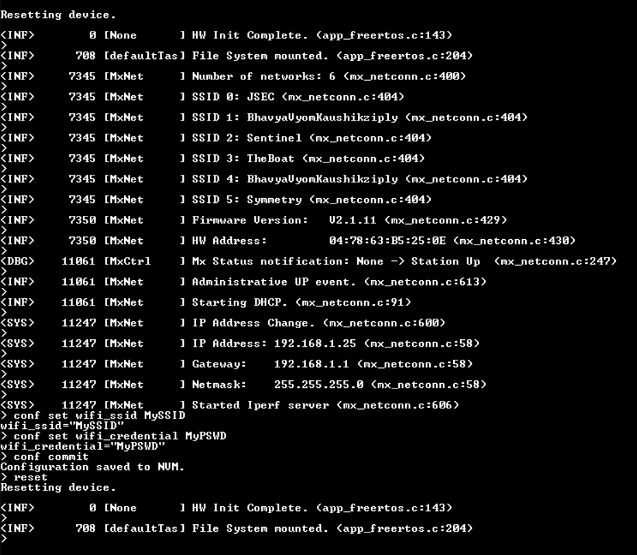
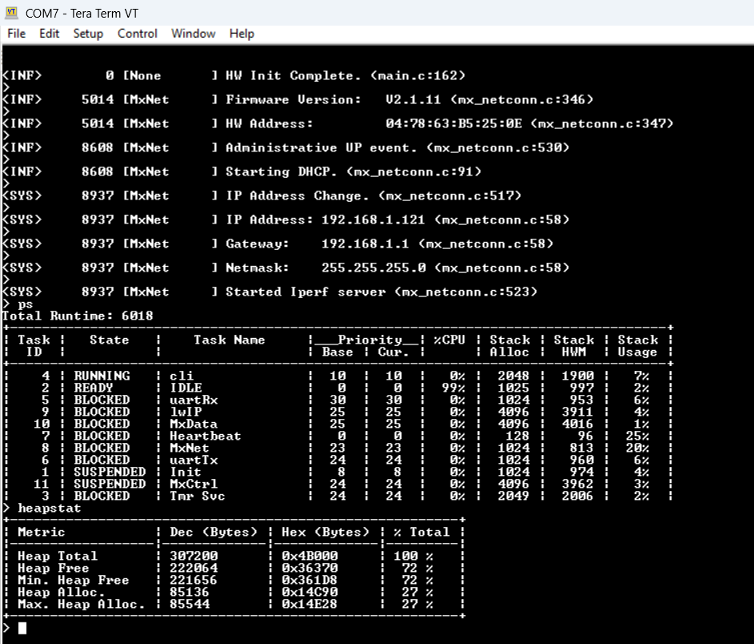

# aware_demo

### Cloning the Repository
To clone using HTTPS:
```
git clone https://github.com/SlimJallouli/aware_demo.git --recurse-submodules
```
Using SSH:
```
git clone git@github.com:SlimJallouli/aware_demo.git --recurse-submodules
```
If you have downloaded the repo without using the `--recurse-submodules` argument, you should run:
```
git submodule update --init --recursive
```

## CMSIS Packs

If you need to regenerate the project with STM32CubeMX, then you need to dowload and install the following CMSIS packs.

[lwIP 2.2.0](https://www.keil.com/pack/lwIP.lwIP.2.2.0.pack)

[mbedTLS 3.1.1](https://www.keil.com/pack/ARM.mbedTLS.3.1.1.pack)

[AWS_IoT_Over-the-air_Update 5.0.1](https://d1pm0k3vkcievw.cloudfront.net/AWS.AWS_IoT_Over-the-air_Update.5.0.1.pack)

[AWS_IoT_Device_Defender 4.1.1](https://d1pm0k3vkcievw.cloudfront.net/AWS.AWS_IoT_Device_Defender.4.1.1.pack)

[AWS_IoT_Device_Shadow 5.0.1](https://d1pm0k3vkcievw.cloudfront.net/AWS.AWS_IoT_Device_Shadow.5.0.1.pack)

[backoffAlgorithm 4.1.1](https://d1pm0k3vkcievw.cloudfront.net/AWS.backoffAlgorithm.4.1.1.pack)

[coreJSON 4.1.1](https://d1pm0k3vkcievw.cloudfront.net/AWS.coreJSON.4.1.1.pack)

[coreMQTT 5.0.1](https://d1pm0k3vkcievw.cloudfront.net/AWS.coreMQTT.5.0.1.pack)

[coreMQTT_Agent 5.0.1](https://d1pm0k3vkcievw.cloudfront.net/AWS.coreMQTT_Agent.5.0.1.pack)


## Wi-Fi Credentails configuration
The Wi-Fi credentials can be changed using the CLI

```
conf set wifi_ssid MySSID
conf set wifi_credential MyPSWD
conf commit
reset
```


### Command Line Interface (CLI)

The CLI interface located in the Common/cli directory is used to provision the device. It also provides other Unix-like utilities. See [Common/cli](Common/cli/ReadMe.md) for details.

- To Use the CLI, Use TeraTerm 115200, 8 bits, No parity, 1 Stop,
- Type **ps** to get statistics on the running tasks
- Type **heapstat** to get the heap statistics
- Type **reset** to reset the device
- Type **help** to get help menu
- Type **conf get** to get the current configuration

